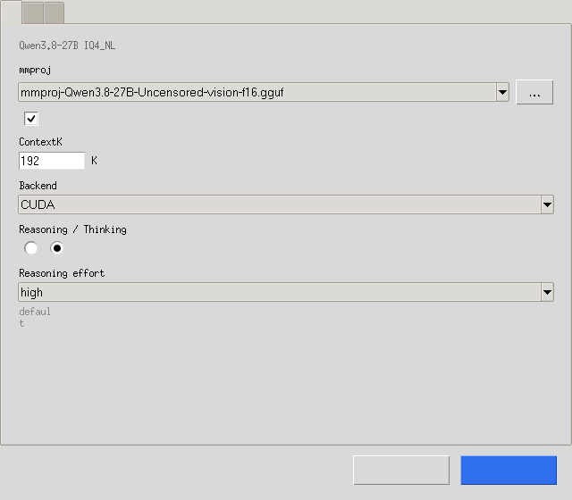
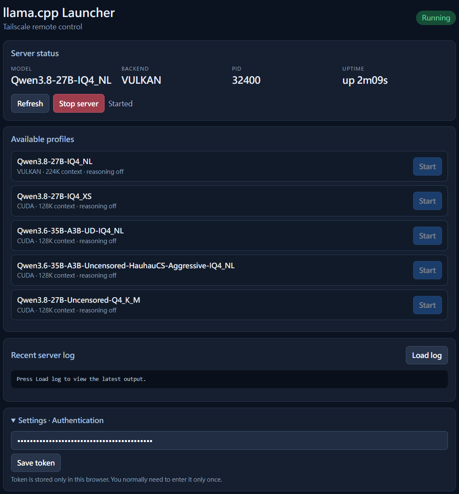

<div align="center">

# 🦙 Llama Launcher

**Windows 上本機 `llama.cpp` 伺服器的桌面控制中心**

啟動、接管、檢視、遠端控制，全部在一個畫面搞定，不用再開 terminal 打指令。

  

</div>

---

## 為什麼用它

跑本機 `llama.cpp` 其實很繁瑣：要記得一堆參數、在 terminal 看 log、手動管理 GPU 分配、還想從手機連回來。**Llama Launcher** 把這些全部包起來：

- ✅ 把各模型存成 profile，一鍵啟動／停止
- ✅ 自動接管已在跑的 `llama-server --port 8080`，不重啟、不停你的東西
- ✅ 整合 Log 檢視，看到 `Vulkan` fallback 還會主動提醒並停止
- ✅ **Tailscale 遠端控制**：從手機／別台電腦安全的連回來
- ✅ **硬體能力地圖**：比較模型／版本／Backend／Vision 的 Context 上限與速度取捨

---

## ✨ 功能總覽

| 功能 | 說明 |
|---|---|
| 🗂️ Model profiles | 每個模型的 context、GPU 分配、KV 精度、reasoning、思考強度、vision 各自獨立存檔 |
| 🗂️ 分頁設定 | 模型設定採「模型／加速／進階」三頁籤，長表單不再把選項擠出視窗 |
| 🧠 思考強度 | llama.cpp `--reasoning-effort`（default/minimal/low/medium/high/xhigh/max），思考模式開啟時可選 |
| 🎮 GPU 分配 | 自動，或自訂各卡層數（如 `16,8`），常用分配自動記住、可刪除 |
| 🚀 一鍵啟動 | 幫你組好 `-ngl -c -ts -ctk/ctv --parallel --reasoning-effort` 等參數，直接 launch |
| 📄 即時 Log | 內嵌 log 面板，偵測到 Vulkan 慢速退化會警告 |
| 🔌 Process 接管 | 偵測既有的 8080 llama-server，直接納管，不重啟 |
| 📶 Tailscale Serve | HTTPS 遠端控制頁＋Bearer token，只綁 localhost 再透過 Tailscale 代理 |
| 💼 全域／個別設定分離 | 開機啟動、llama.cpp 路徑、遠端存取＝全域；模型參數＝個別 |
| ♻️ 舊資料遷移 | 從舊版 launcher 匯入 profiles／token，一鍵搬家 |
| 📦 Profile 匯出／匯入 | 可攜 JSON（不含本機路徑），換機/分享輕鬆 |
| 📊 硬體能力與模型選型 | 依 llama.cpp build、模型、Backend、Vision 彙整最大已驗證 Context、穩定速度、疊加曲線與 Pareto 取捨圖 |

---

## 📸 畫面


*主畫面：Favorite Models、整合 Log、一鍵 Start/Stop；思考強度直接在 THINKING 下拉選（off = 不思考）*



*模型設定採分頁（模型／加速／進階），不再一長串把選項擠出視窗*



*Tailscale 遠端控制頁：狀態、模型、Start/Stop、Log*

---

## 🚀 快速開始

### Windows

1. 到本專案的 [Releases](https://github.com/pttocean-afk/llama-launcher/releases)下載 `LlamaLauncher-Setup-x64.exe` 安裝，或解壓 `LlamaLauncher-Portable-x64.zip`
2. 啟動後選擇**包含 `llama-server.exe` 的資料夾**
3. 把 GGUF 模型放進它的 `models` 子資料夾（可自行建立子資料夾分類，例如 `models\Coding\qwen.gguf`，掃描會遞迴讀取）
4. 選好模型 → 按 **START SERVER**

> 本專案目前僅正式支援 Windows 10/11；Linux CI 與發佈產物暫停維護。

---

## 📶 遠端控制（Tailscale）

1. 主畫面 → **Settings → Remote Access**
2. 系統偵測 Tailscale（需先安裝並登入）
3. 完成後取得：
   - **HTTPS 網址**（例：`https://your-pc.tail.ts.net`）
   - **控制 Token**（私人字串）
4. 手機／別台電腦開網址 → 貼 Token → 即可看狀態、選模型、啟動／停止

**安全設計**：控制 API 只綁 `127.0.0.1:8765`，對外一律透過 Tailscale Serve HTTPS 代理；`/api/*` 全需 Bearer token。推理埠 `8080` 不直接暴露。

---

## 🗂️ 資料存放位置

| 類型 | 位置 |
|---|---|
| Windows 使用者資料 | `%LOCALAPPDATA%\LlamaLauncher` |
| 測試覆寫 | 用 `LLAMA_LAUNCHER_DATA_DIR` 環境變數 |

程式與資料分離：移除「程式」不影響你的 profiles／設定。正式發佈產物為 Windows Setup EXE 與 Portable ZIP。

---

## 📊 效能分析

主畫面 → **📊 效能分析** 會先開啟「硬體能力與模型選型」dashboard，用現有 logs 回答哪個配置能跑多大 Context、速度要犧牲多少。

- **Build 單選**：一次只比較一個 llama.cpp build（例如 `b10770`），避免版本差異污染排名。
- **模型複選**：依實際啟動次數排序；預設勾選最常用的模型，可全選或清除。
- **能力總覽**：以模型＋Backend＋Vision＋KV／Reasoning／GPU split 為配置，顯示最大已驗證可推論 Context、最大僅啟動 Context、首次失敗 Context、穩定中位速度與觀測最高速度。
- **啟動判定**：log 出現 `llama_server: listening` 才算可啟動；至少完成一筆正常 decode 才算可推論。OOM 後若 runtime 最後仍 listening，不會誤判失敗。
- **Vision 判定**：分開記錄 `--mmproj` 是否被要求及 server 是否真的回報 multimodal model loaded；`ON ✓` 代表已確認載入。
- **速度曲線比較**：雙擊配置或點橫條即可加入／移除多條曲線；X 軸為實際 used context、Y 軸為 Decode T/S，實線是中位數、陰影是 P25–P75。
- **Context／速度取捨圖**：散點圖右上角越好，Pareto frontier 標示沒有被其他配置同時在 Context 與速度上超越的選項。
- **速度品質**：預設排除 generated < 20 tokens；「穩定速度」取最低可用 context bucket 的中位數，另保留觀測最高值供切換。
- **最大已驗證，不是理論值**：若沒有測過更高 Context，介面不會把目前最高紀錄誤稱為硬體極限；有失敗紀錄時才顯示首次失敗邊界。
- **來源與匯出**：預設唯讀掃描 `%LOCALAPPDATA%\LlamaLauncher\logs`，也可匯入單檔／資料夾；能力摘要可匯出 CSV。原本 decode/prefill、公平性警告與 HTML/PNG/SVG/CSV/Markdown 匯出保留在「舊版詳細統計 / 匯出」。

---

## 🧪 開發 / 測試

```bash
python3 -m venv .venv
.venv/bin/pip install -e '.[dev]'
.venv/bin/pytest
```

**Windows source 測試（不打包）**

```powershell
.\scripts\run-dev-windows.ps1
```

**Windows 本機 release build（WSL，一個指令）**

```bash
bash scripts/build-release-windows.sh
```

> 腳本會重建乾淨 mirror、測試、打包、清理中間檔，並只保留 Setup EXE 與 Portable ZIP。完整 SOP 見 [docs/BUILD-WINDOWS.md](docs/BUILD-WINDOWS.md)。
>
> Windows 打包與 GitHub Release 上傳流程見 [docs/RELEASING.md](docs/RELEASING.md)。

CI：`.github/workflows/windows-build.yml` 提供 Windows 自動 test＋build。Linux CI／發佈產物目前停止維護。

---

## 🔒 安全性

- 控制 Token 固定長度比對，防時序攻擊
- 資料檔 atomic 寫入，避免中途損毀
- 遠端 dashboard 以 DOM 建構渲染（無 `innerHTML` 注入）
- start/stop 共用作業鎖，避免多執行緒同時啟停
- 本機資料目錄結構在 `.gitignore` 排除 Token／模型／絕對路徑／Log

---

## 📄 License

本專案以 **MIT License** 釋出。請見 [LICENSE](LICENSE)。

---

## 🙏 致謝

- [llama.cpp](https://github.com/ggerganov/llama.cpp)
- [pystray](https://github.com/moses-palmer/pystray)、[psutil](https://github.com/giampaolo/psutil)、[Tailscale](https://tailscale.com)

---

# English

## 🦙 Llama Launcher

**A Windows desktop control center for local `llama.cpp` servers.**

Launch, adopt, log, and remotely control your local llama.cpp server from one
window — no terminal, no remembering flags.

## Why

Running local llama.cpp is fiddly: model-specific flags, terminal logs, manual
GPU split, and remote access are a pain. **Llama Launcher** wraps it all up:

- **Model profiles** — save each model's context, GPU split, KV precision,
  reasoning, and vision settings independently, then launch with one click.
- **Process adoption** — detects an already-running `llama-server --port 8080`
  and manages it without a restart.
- **Integrated log panel** — warnings when the Vulkan runtime falls back to a
  slow no-parallel-pipeline mode.
- **Tailscale remote control** — a secure HTTPS control page (Bearer token)
  accessible from your phone or another machine.
- **Hardware capability map** — compare verified context limits and speed trade-offs across models, builds, backends, and Vision modes.

## Feature snapshot

| Feature | Description |
|---|---|
| Model profiles | Per-model context / GPU split / KV / reasoning / thinking intensity / vision |
| Tabbed settings | Per-model dialog uses Model / Performance / Advanced tabs — long forms no longer overflow the window |
| Thinking intensity | llama.cpp `--reasoning-effort` (default/minimal/low/medium/high/xhigh/max), chosen when reasoning is on |
| GPU split | Auto, or custom layers per GPU (e.g. `16,8`); presets remembered & removable |
| One-click start | Builds `-ngl -c -ts -ctk/ctv --parallel --reasoning-effort` args for you |
| Live logs | Embedded log viewer with Vulkan-fallback warnings |
| Process adoption | Manages an existing 8080 server without restarting it |
| Tailscale Serve | HTTPS remote page + Bearer token, localhost-bound behind Tailscale |
| Global / per-model settings | Autostart, llama.cpp path, remote access = global |
| Legacy migration | Import old profiles / token in one click |
| Profile export/import | Portable JSON (no local absolute paths) |
| Hardware capability & model selection | Verified context limits, stable-speed ranking, overlay curves, and a Pareto trade-off map by build/model/backend/Vision |

## Screenshots


*Main screen: favorite models, integrated log, one-click Start/Stop; thinking is chosen in the THINKING dropdown (off = no thinking)*


*Per-model settings use tabs (Model / Performance / Advanced), so long forms no longer overflow the window*

## Quick start

**Windows:** grab `LlamaLauncher-Setup-x64.exe` or `LlamaLauncher-Portable-x64.zip`
from [Releases](https://github.com/pttocean-afk/llama-launcher/releases). Pick the
folder containing `llama-server.exe`, drop GGUFs into its `models` subfolder
(subfolders are scanned recursively, e.g. `models\Coding\qwen.gguf`),
select a model, press **START SERVER**.

> Official builds currently target Windows 10/11 only. Linux CI and release artifacts are not maintained.

## Remote access (Tailscale)

Main screen → **Settings → Remote Access**. The app sets up Tailscale Serve and
shows an HTTPS URL plus a private control token. Open the URL elsewhere, paste
the token, and you can view status, pick a model, and start/stop the server.

The control API binds only to `127.0.0.1:8765` and is exposed exclusively
through Tailscale Serve HTTPS; every `/api/*` route requires a Bearer token.
The inference port `8080` is never exposed as the control channel.

## Data locations

| Type | Location |
|---|---|
| Windows user data | `%LOCALAPPDATA%\LlamaLauncher` |
| Test override | `LLAMA_LAUNCHER_DATA_DIR` env var |

## Performance analysis

Main screen → **📊 Performance analysis** opens the hardware-capability and
model-selection dashboard. It uses observed logs to answer which configuration
can run at which context and what speed is sacrificed.

- **Single build selector** — compare one llama.cpp build (for example
  `b10770`) at a time.
- **Multi-model checklist** — models are sorted by launch count.
- **Capability overview** — groups by model, backend, Vision, KV, reasoning and
  GPU split; shows maximum verified inference context, startup-only context,
  first failed context, stable median speed, and observed peak speed.
- **Reliable outcomes** — `llama_server: listening` verifies startup; a
  completed decode verifies inference. A recoverable OOM followed by listening
  is not misclassified as failure.
- **Vision evidence** — records both requested `--mmproj` and confirmed
  multimodal-model loading (`ON ✓`).
- **Overlay curves** — double-click configurations or click ranking bars to
  compare median Decode T/S vs actual used context, including P25–P75 bands.
- **Trade-off map** — Context vs stable-speed scatter with a Pareto frontier;
  points toward the upper-right offer the strongest trade-off.
- **No overclaiming** — limits are labelled “maximum verified,” not theoretical
  hardware limits. A failed boundary is shown only when a higher context was
  actually observed to fail.
- **Sources and export** — read-only scan of
  `%LOCALAPPDATA%\LlamaLauncher\logs`, plus file/folder imports and capability
  CSV export. The previous detailed decode/prefill analysis and HTML/PNG/SVG/
  CSV/Markdown exports remain available through **Legacy detailed stats /
  export**.

## Development

```bash
python3 -m venv .venv
.venv/bin/pip install -e '.[dev]'
.venv/bin/pytest
```

**Run Windows source without packaging**

```powershell
.\scripts\run-dev-windows.ps1
```

**Local Windows release build (one WSL command)**

```bash
bash scripts/build-release-windows.sh
```

> The script recreates a clean mirror, tests, packages, removes intermediates,
> and keeps only Setup EXE plus Portable ZIP. See [docs/BUILD-WINDOWS.md](docs/BUILD-WINDOWS.md).
>
> Windows packaging and GitHub Release publishing flow:
> see [docs/RELEASING.md](docs/RELEASING.md).

The official CI and release artifacts currently target Windows only.

## License

MIT — see [LICENSE](LICENSE).
