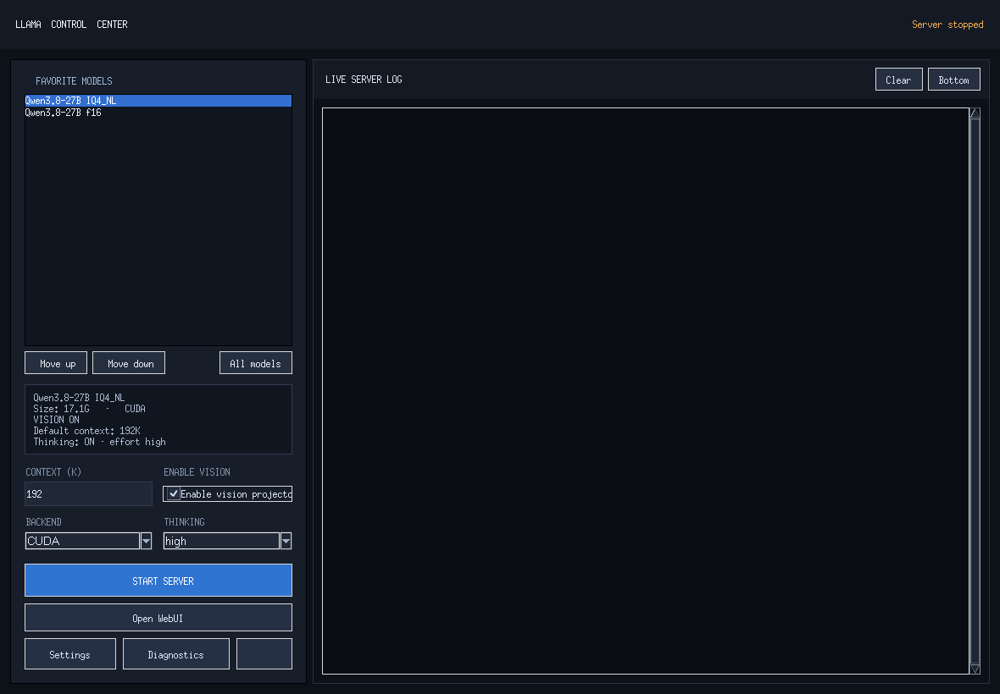

<div align="center">

# 🦙 Llama Launcher

**本機 `llama.cpp` 伺服器的跨平台桌面控制中心 — Windows / Linux**

啟動、接管、檢視、遠端控制，全部在一個畫面搞定，不用再開 terminal 打指令。

   

</div>

---

## 為什麼用它

跑本機 `llama.cpp` 其實很繁瑣：要記得一堆參數、在 terminal 看 log、手動管理 GPU 分配、還想從手機連回來。**Llama Launcher** 把這些全部包起來：

- ✅ 把各模型存成 profile，一鍵啟動／停止
- ✅ 自動接管已在跑的 `llama-server --port 8080`，不重啟、不停你的東西
- ✅ 整合 Log 檢視，看到 `Vulkan` fallback 還會主動提醒並停止
- ✅ **Tailscale 遠端控制**：從手機／別台電腦安全的連回來
- ✅ 雙平台共用同一套核心，Windows / Linux 行為一致

---

## ✨ 功能總覽

| 功能 | 說明 |
|---|---|
| 🗂️ Model profiles | 每個模型的 context、GPU 分配、KV 精度、reasoning、vision 各自獨立存檔 |
| 🎮 GPU 分配 | 自動，或自訂各卡層數（如 `16,8`），常用分配自動記住、可刪除 |
| 🚀 一鍵啟動 | 幫你組好 `-ngl -c -ts -ctk/ctv --parallel` 等參數，直接 launch |
| 📄 即時 Log | 內嵌 log 面板，偵測到 Vulkan 慢速退化會警告 |
| 🔌 Process 接管 | 偵測既有的 8080 llama-server，直接納管，不重啟 |
| 📶 Tailscale Serve | HTTPS 遠端控制頁＋Bearer token，只綁 localhost 再透過 Tailscale 代理 |
| 💼 全域／個別設定分離 | 開機啟動、llama.cpp 路徑、遠端存取＝全域；模型參數＝個別 |
| ♻️ 舊資料遷移 | 從舊版 launcher 匯入 profiles／token，一鍵搬家 |
| 📦 Profile 匯出／匯入 | 可攜 JSON（不含本機路徑），換機/分享輕鬆 |

---

## 📸 畫面

> 〔截圖待補〕把主畫面截圖存成 `docs/screenshot.png` 即可顯示：



---

## 🚀 快速開始

### Windows

1. 到本專案的 [Releases](https://github.com/your-user/llama-launcher/releases)（把 `your-user` 換成你的 GitHub 帳號）下載 `LlamaLauncher-Setup-x64.exe` 安裝，或解壓 `LlamaLauncher-Portable-x64.zip`
2. 啟動後選擇**包含 `llama-server.exe` 的資料夾**
3. 把 GGUF 模型放進它的 `models` 子資料夾
4. 選好模型 → 按 **START SERVER**

### Linux (x86_64)

```bash
wget -c https://github.com/your-user/llama-launcher/releases/latest/download/LlamaLauncher-Linux-x86_64.tar.gz  # 把 your-user 換成你的帳號
tar -xzf LlamaLauncher-Linux-x86_64.tar.gz
./LlamaLauncher/LlamaLauncher
```

> 首次啟動會請你挑 `llama-server` 所在資料夾。

---

## 📶 遠端控制（Tailscale）

1. 主畫面 → **Settings → Remote Access**
2. 系統偵測 Tailscale（需先安裝並登入）
3. 完成後取得：
   - **HTTPS 網址**（例：`https://your-pc.tail.ts.net`）
   - **控制 Token**（私人字串）
4. 手機／別台電腦開網址 → 貼 Token → 即可看狀態、選模型、啟動／停止

**安全設計**：控制 API 只綁 `127.0.0.1:8765`，對外一律透過 Tailscale Serve HTTPS 代理；`/api/*` 全需 Bearer token。推理埠 `8080` 不直接暴露。

---

## 🗂️ 資料存放位置

| 平台 | 使用者資料 |
|---|---|
| Windows | `%LOCALAPPDATA%\LlamaLauncher` |
| Linux | `$XDG_DATA_HOME/LlamaLauncher` 或 `~/.local/share/LlamaLauncher` |
| 測試覆寫 | 用 `LLAMA_LAUNCHER_DATA_DIR` 環境變數 |

程式與資料分離：移除「程式」不影響你的 profiles／設定。

---

## 🖥️ 平台行為

| | Windows | Linux |
|---|---|---|
| 執行檔 | `llama-server.exe` | `llama-server` |
| Process 探測 | `psutil` | `psutil` |
| 遠端存取 | Tailscale Serve HTTPS | Tailscale Serve HTTPS |
| 關閉按鈕預設 | 縮到系統匣 | 安全退出（tray 支援因桌面而異） |
| 發佈產物 | Setup EXE ＋ Portable ZIP | Portable x86_64 tar.gz |

電腦專屬路徑皆為本機設定；匯入 profile 不假設 Windows 路徑在 Linux 也有效。

---

## 🧪 開發 / 測試

```bash
python3 -m venv .venv
.venv/bin/pip install -e '.[dev]'
.venv/bin/pytest
```

**Windows build**

```powershell
.\scripts\build-windows.ps1
.\scripts\build-installer.ps1
```

**Linux build**（用 distro 系統 Python，須含 Tk）

```bash
sudo apt-get install python3-tk python3-venv xvfb
python3 -m venv .venv-build
PATH="$PWD/.venv-build/bin:$PATH" bash scripts/build-linux.sh
```

CI：`.github/workflows/` 提供 Windows / Linux 自動 build＋test。

---

## 🔒 安全性

- 控制 Token 固定長度比對，防時序攻擊
- 資料檔 atomic 寫入，避免中途損毀
- 遠端 dashboard 以 DOM 建構渲染（無 `innerHTML` 注入）
- start/stop 共用作業鎖，避免多執行緒同時啟停
- 本機資料目錄結構在 `.gitignore` 排除 Token／模型／絕對路徑／Log

---

## 📄 License

本專案以 **MIT License** 釋出。請見 [LICENSE](LICENSE)。

---

## 🙏 致謝

- [llama.cpp](https://github.com/ggerganov/llama.cpp)
- [pystray](https://github.com/moses-palmer/pystray)、[psutil](https://github.com/giampaolo/psutil)、[Tailscale](https://tailscale.com)
